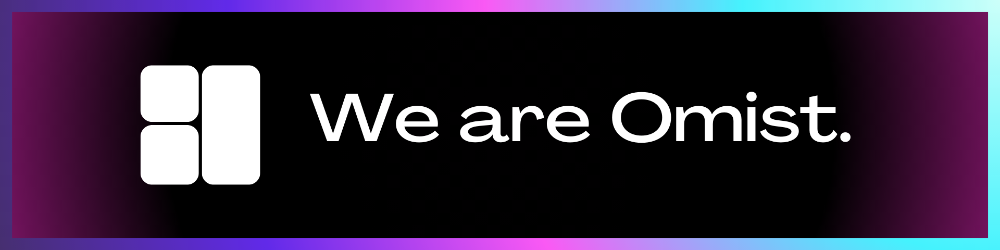

*We are Omist.* Our mission is to revolutionize the Minecraft modding experience by creating a robust, user-friendly, and versatile platform that empowers developers to bring their most imaginative ideas to life. We believe in the limitless potential of Minecraft's modding community and strive to provide the tools and support needed to unlock new levels of creativity and innovation.

### Omist ❤️ Open Source

At Omist, "open source" is a fundamental concept. We believe that sharing our projects' source code will help achieve pur goal at empowering players. And that is the reason behind the decision of sharing our code to the community.

### Omist ❤️ Contributors
Omist projects are a great way to start in the field of Minecraft development if you're looking to get involved :

- [See our featured projects on Github](https://github.com/OmistFramework)
<!-- - [Read more about <u>Omist ❤️ Opensource</u>](https://omistframework.github.io/opensource)

Omist projects adopt the [Omist Code of Conduct]().-->